- [Angular](#angular)
    - [RoadMap](#roadmap)
    - [Angular start sequence and how does it work](#angular-start-sequence-and-how-does-it-work)
      - [1. `main.ts`](#1-maints)
      - [2. `app.module.ts` - `AppModule`](#2-appmodulets---appmodule)
      - [3. `app.component.ts` - `AppComponent`](#3-appcomponentts---appcomponent)
      - [4. `app.compoent.html` and `app.component.css` are injected into `app.component.ts`](#4-appcompoenthtml-and-appcomponentcss-are-injected-into-appcomponentts)
      - [5. `selector: 'app-root'`  <---> `<app-root></app-root>`](#5-selector-app-root------app-rootapp-root)
      - [6. templateUrl: './app.component.html' <---> `<app-root></app-root>`](#6-templateurl-appcomponenthtml-----app-rootapp-root)
      - [7. component vs template vs module](#7-component-vs-template-vs-module)
    - [How to create a component and use it](#how-to-create-a-component-and-use-it)
        - [@NgModel](#ngmodel)
        - [Declaration {}](#declaration-)
        - [cli](#cli)
        - [Use `template`](#use-template)
        - [use `styles` or `styleUrls`](#use-styles-or-styleurls)
    - [Selector](#selector)
        - [Selector define the selector for current component, how it is represented in the HTML DOM.](#selector-define-the-selector-for-current-component-how-it-is-represented-in-the-html-dom)
      - [Selector as the Element Name](#selector-as-the-element-name)
      - [Selector as an Attribute](#selector-as-an-attribute)
      - [Selector as a Class](#selector-as-a-class)
        - [string intepolation](#string-intepolation)
    - [Property binding](#property-binding)
      - [property binding vs string interpolation](#property-binding-vs-string-interpolation)
    - [Data Biding](#data-biding)
      - [event biding](#event-biding)
      - [two-way-data-binding](#two-way-data-binding)

# Angular

This the Angular learning notes, and a ecommerce example from angular office website.

* bootstrap(css)
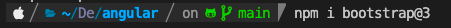


https://angular.io/start

Basic Angular structure(component)
* A component class - Handles data and functionality.
* An HTML template - Determines the UI.
* Component-specific styles - Define the look and fell.


### RoadMap


### Angular start sequence and how does it work
`main.ts  >>   app.Module.ts  >>  app.component.ts  >>  index.html  >>  app.component.html `

#### 1. `main.ts`
```typescript
platformBrowserDynamic().bootstrapModule(AppModule)
  .catch(err => console.error(err));
```
  * Everything starts from `main.ts`

`main.ts` -> `bootstrap`-> `AppModule`-> `app.component.ts`

  * `main.ts` is the entry point 

  * `main.ts` bootstraps the application with `AppModule`

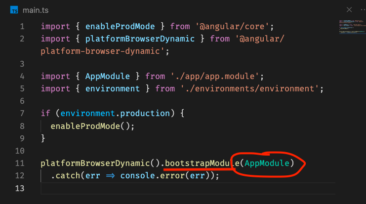

#### 2. `app.module.ts` - `AppModule`

* `AppModule` is the root module of the application.
* `AppModule` boostraps the with applicaition with `AppCompnent`
***This is where Angular replace the `<app-root></app-root>` tag in `index.html`
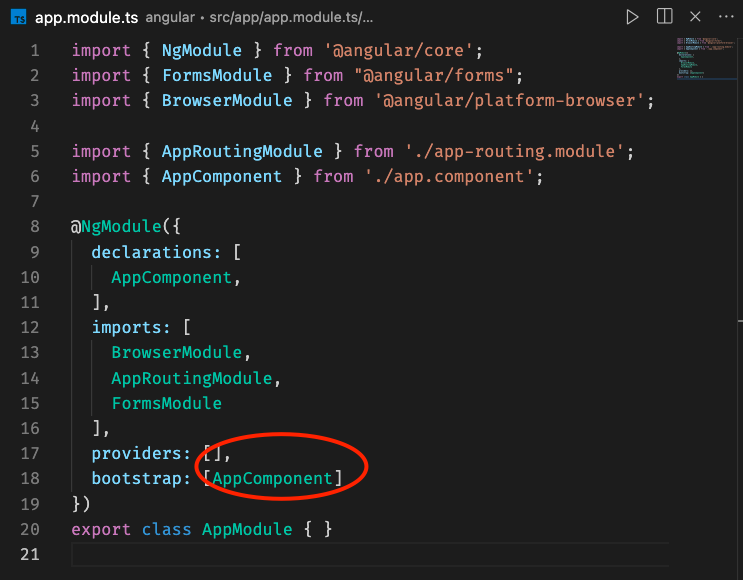
```typescript
  bootstrap: [AppComponent]
```
- it is the way to tell angular witch component you should be aware of when the application starts.

#### 3. `app.component.ts` - `AppComponent`
* `AppComponent` is the root component of the application.


#### 4. `app.compoent.html` and `app.component.css` are injected into `app.component.ts`
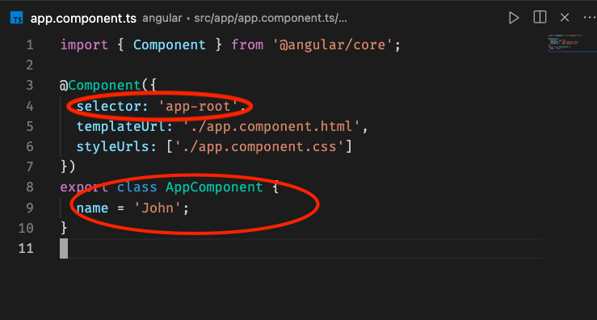
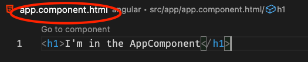

#### 5. `selector: 'app-root'`  <---> `<app-root></app-root>`
*  selector is the tag that will be used to identify the component other template.

#### 6. templateUrl: './app.component.html' <---> `<app-root></app-root>`
* templateUrl is the path to the template file that will be used to render `<app-root></app-root>`
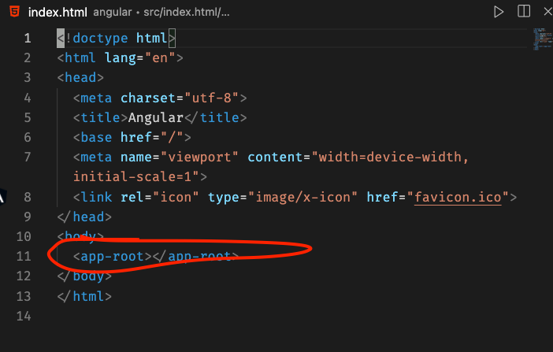

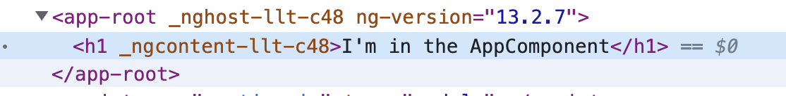

#### 7. component vs template vs module
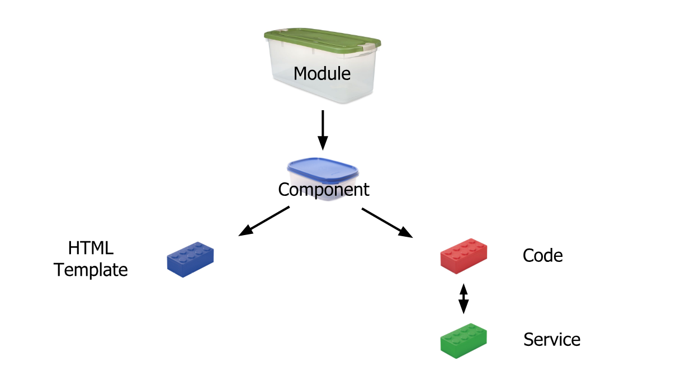 

### How to create a component and use it
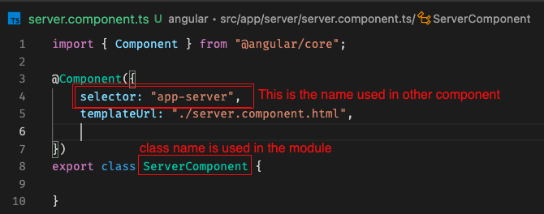
1. ####  `@Component`
   - Decorator that marks a class as an Angular component and provides configuration ***metadata*** that determines how the component should be processed, instantiated, and used at runtime.
2. #### `templateUrl`
   * The relative path or absolute URL of a template file for an Angular component. If provided, do not supply an inline template using `template`.
3. #### `selector` 
   - is used to identify each component uniquely into the component tree, and it also defines how the current component is represented in the HTML DOM.
   - 
4. #### Component Vs Selector Vs Template
   - Component(AppComponent) is the referce to the component in the application(typescript code).
   - Selector is the reference to the component in the HTML.
   - Template is the HTML that will be rendered to the screen.

5. #### Decalre the component in the module
   ##### @NgModel
    - The `@NgModel` decorator marks a class as an Angular component and provides configuration metadata that determines how the component should be processed, instantiated, and used at runtime.
   ##### Declaration {}
    - `declarations:{ AppComponent, ServerComponent}`(this is the way to tell angular that this component is used in the application)
    - `ServerComponent` the class name
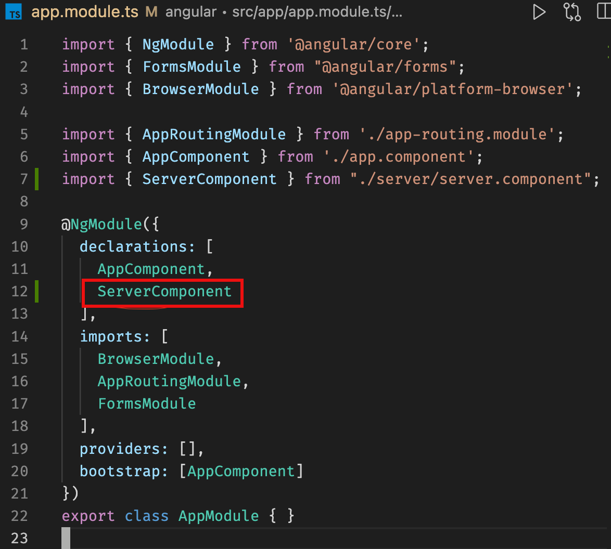

6. #### Then import it to the `app.module.ts`, then it can be used in `app.component.html`


7. #### Use CLI to create a component
##### cli

`server.component.ts`

`app.module.ts`

browser


##### Use `template`

`template` or `templateUrl` is a must.

##### use `styles` or `styleUrls`


### Selector
##### Selector define the selector for current component, how it is represented in the HTML DOM.

* They are the same as the tag name in the HTML.
* They are the same as the css selector.
* They are the same as attribute selector.
  


#### Selector as the Element Name
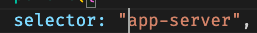
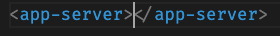
#### Selector as an Attribute
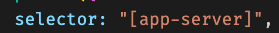
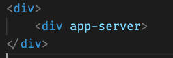
#### Selector as a Class
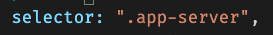
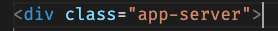

##### string intepolation


### Property binding


#### property binding vs string interpolation


### Data Biding
#### event biding


#### two-way-data-binding


