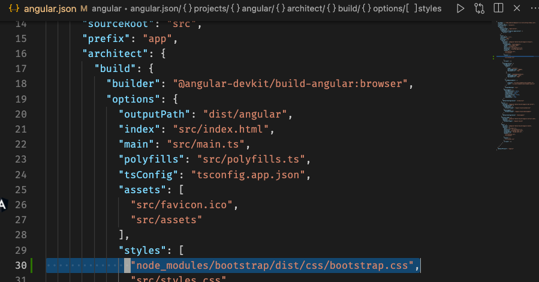

# Angular

This the Angular learning notes, and a ecommerce example from angular office website.

#### bootstrap(css)

https://angular.io/start

#### Componnent

* A component class - Handles data and functionality.
* An HTML template - Determines the UI.
* Component-specific styles - Define the look and fell.

## RoadMap

#### Angular start sequence and how does it work
`main.ts` -> `bootstrap`-> `AppModule`-> `app.component.ts`

* `main.ts` is the entry point 

* `AppModule` knows bootrstrap after `main.ts` loading

* `app.component.ts` knows bootstrap after `AppModule` loading

* `bootstrap` is ready for using in `app.component.ts`

* `app.compoent.html` is injected into `<app-root>`

* `<app-root></app-root>`

### How to create a component and use it

1. `@Component`
Decorator that marks a class as an Angular component and provides configuration metadata that determines how the component should be processed, instantiated, and used at runtime.
2. `templateUrl`
The relative path or absolute URL of a template file for an Angular component. If provided, do not supply an inline template using `template`.
3.  A `selector` is used to identify each component uniquely into the component tree, and it also defines how the current component is represented in the HTML DOM.
`Component` = `template` + `selector`

4. Decalre the component in the module
`ServerComponent` the class name

5. then import it to the `app.module.ts`, then it can be used in `app.component.html`

#### Use CLI to create a component
cli

`server.component.ts`

`app.module.ts`

browser

#### Use `template`

`template` or `templateUrl` is a must.

#### use `styles` or `styleUrls`

#### attribute selector

#### string intepolation

#### property binding

#### property binding vs string interpolation

### Data Biding
#### event biding

#### two-way-data-binding

