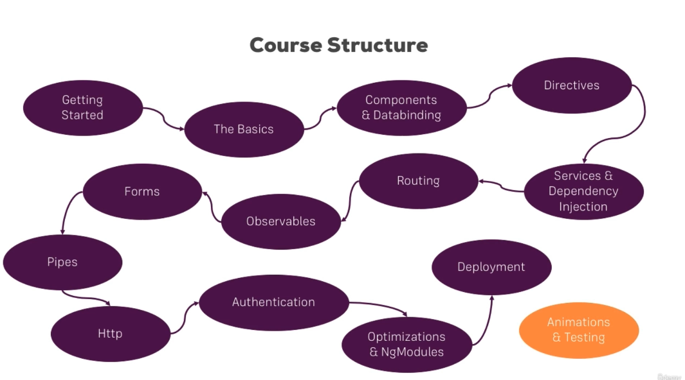

# Angular

This the Angular learning notes, and a ecommerce example from angular office website.

https://angular.io/start

#### Componnent

A component class - Handles data and functionality.
An HTML template - Determines the UI.
Component-specific styles - Define the look and fell.

#### RoadMap

#### bootstrap

#### `<app-root></app-root>`
This is replaced by the angular.

#### `main.ts` `bootstrap` `AppModule` `app.component.ts`
Angular start sequence

* `AppModule` knows bootrstrap after `main.ts` loading

* `app.component.ts` knows bootstrap after `AppModule` loading

* `bootstrap` is ready for using in `app.component.ts`

